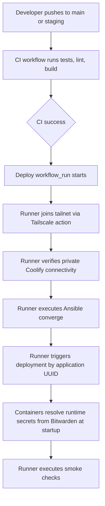

# NEUROMANCERS Network — Architecture Overview

**Stack:** Django 6.x · Wagtail 7.x · HTMX · Celery · PostgreSQL 18 · GetPronto · Proton Mail SMTP  
**Deployment:** Coolify on Hetzner via GitHub Actions  
**Last updated:** 2026-05-11 (post implementation audit)

---

## 1. System Diagram

```
                              ┌─────────────────────┐
                              │     Web Browser     │
                              └──────────┬──────────┘
                                         │ HTTPS
                              ┌──────────▼──────────┐
                              │   Coolify (Caddy    │
                              │    reverse proxy,   │
                              │    Let's Encrypt)   │
                              └──┬───────────────┬──┘
                                 │               │
                    ┌────────────▼───┐     ┌─────▼──────────┐
                    │ Django/Wagtail │     │ PostgreSQL 18  │
                    │ (Gunicorn)     │◄───►│                │
                    └───────┬────────┘     └────────────────┘
                            │
                            │ Redis (Celery broker + cache)
                            ▼
                     ┌───────────────┐
                     │ Celery Worker │────── External APIs
                     └───────────────┘
```

External APIs: Stripe (payments), Whereby (video rooms), GetPronto (asset storage), MJML (email rendering), Google Calendar, Microsoft Graph, iCloud CalDAV, Proton Mail SMTP.

---

## 2. Secrets Model

The platform uses a strict split between deploy-time infrastructure secrets and runtime application credentials.

### Deploy-time secrets (GitHub environments)

- Source of truth is GitHub environment secrets only.
- Branch mapping is fixed:
  - `main` deploys with the `production` environment
  - `staging` deploys with the `staging` environment
- GitHub Actions reads deploy-time values and passes them to Ansible and deployment steps.
- Deploy-time values must never be committed in repository-tracked `.env` files.

### Runtime third-party API credentials (Admin-managed)

- Third-party API credentials are runtime-managed by Admin in Wagtail Site Settings.
- These credentials are not stored in GitHub Actions secrets and are not part of CI/CD injection.
- This includes Stripe, Whereby, GetPronto, MJML, SMTP provider credentials, and Sentry DSN.

### Beszel keys policy

- Beszel hub/agent keys are runtime-only values.
- Beszel keys are never retained in GitHub Actions secrets and never passed through CI.
- Beszel setup and key management happens at runtime via Beszel administration.

### `.envs/.production/` policy

- Files under `.envs/.production/` are templates only.
- They can document required variable names but must not contain live credentials.
- Live production values are injected from GitHub environment secrets and/or Admin runtime settings.

---

## 3. Core Technology Stack

| Layer | Component | Version / Pin |
|-------|-----------|---------------|
| **Framework** | Django + Wagtail | Django 6.x, Wagtail 7.x |
| **Auth** | django-allauth | ≥65.13.0 |
| **Permissions** | django-guardian | ≥3.3.0 |
| **API** | Django Ninja | ≥1.5.0 |
| **Frontend** | HTMX + Django templates | django-htmx ≥1.27.0, DaisyUI 5 (CDN) |
| **Task Queue** | Celery + Redis | Celery 5.5+, django-celery-beat ≥2.8.1 |
| **Database** | PostgreSQL 18 | psycopg (binary) |
| **Asset Storage** | GetPronto (images) + S3 (documents) | https://api.getpronto.io/v1, django-storages |
| **Caching** | Redis | Also Celery broker |
| **Email Delivery** | Proton Mail SMTP | django.core.mail SMTP backend, smtp.protonmail.ch:587 |
| **Email Rendering** | MJML API | https://api.mjml.io (write MJML, Wagtail stores content, API renders to HTML) |
| **Payments** | Stripe Connect via direct SDK | `stripe` Python package (no dj-stripe for Connect; dj-stripe for admin webhook UI) |
| **Video Rooms** | Whereby REST API | `httpx` |
| **Calendar Sync** | Google API, Microsoft Graph, CalDAV (python-caldav) | Async via Celery *(not started)* |
| **Monitoring** | Sentry | sentry-sdk ≥2.x |
| **CI/CD** | GitHub Actions → Coolify API | Docker Compose, `iac/` directory |
| **Branding** | Wagtail GenericSettings | SiteDesignSettings, NavbarSettings, FooterSettings, AllAuthSettings |
| **API Keys** | Wagtail GenericSettings (ExternalAPISettings) | Whereby, GetPronto, Stripe Connect keys editable by admin without redeploy |
| **Audit Log** | django-auditlog | 3.0.0 (2025-03) — wired on Session, SessionBooking, SessionPrice, Review |
| **i18n** | django-rosetta | Installed — LANGUAGES configured, URLs registered |

---

## 4. Verified Dependency Register (2025/2026 Releases Only)

### Core Django Packages

| Package | Latest | Released | Role |
|----------|--------|----------|------|
| django-allauth | 65.13.0 | Oct 2025 | Authentication, social login, MFA |
| django-guardian | 3.3.0 | Feb 2026 | Object-level permissions |
| django-taggit | 6.1.0 | 2025 | Tagging for profiles & sessions |
| django-fsm-2 | 4.2.4 | Mar 2026 | Finite state machine (tier progression, session status) |
| django-htmx | 1.27.0 | Nov 2025 | HTMX integration helpers |
| django-ninja | 1.5.0 | Nov 2025 | Type-safe REST API framework |
| django-filter | 25.2 | Oct 2025 | Session listing filters |
| django-recurrence | 1.14 | Dec 2025 | Recurring date rules (RRULE) |
| django-recurring | 1.3.3 | Mar 2026 | iCal-compatible calendar entries, .ics export |
| django-scheduler | 0.12.0 | Feb 2026 | Calendar UI & event management |
| django-widget-tweaks | 1.5.1 | Jan 2026 | Form field CSS class manipulation |
| django-extensions | 4.1 | 2025 | Dev helpers (shell_plus, graph_models) |
| django-debug-toolbar | 6.1.0 | 2025 | Request/query profiling |
| django-cors-headers | 4.9.0 | Sep 2025 | CORS headers |
| django-colorfield | 0.14.0 | Apr 2025 | Colour picker field for models |
| django-storages | 1.14.6 | Apr 2025 | Storage backend abstraction |

### Wagtail CMS Packages

| Package | Latest | Released | Role |
|----------|--------|----------|------|
| Wagtail | 7.3.1 | — | CMS, ModelAdmin, Site settings |
| wagtail-color-panel | 1.8.1 | Apr 2026 | Colour picker for Wagtail admin |
| wagtail-markdown | 0.13.0 | Oct 2025 | Markdown fields & StreamField blocks |
| wagtail-link-block | 1.2 | Mar 2026 | Link/URL selection blocks |
| wagtailmenus | 4.0.7 | Apr 2026 | Navigation menus |

### Payments & Email

| Package | Latest | Released | Role |
|----------|--------|----------|------|
| stripe | ≥12.0 | 2026 | Stripe Connect SDK (direct usage; dj-stripe for admin UI) |
| dj-stripe | ≥2.10.3 | — | Stripe admin UI (webhook endpoint management) |
| django-anymail | ≥14.0 | — | Email backend abstraction |
| MJML API | — | SaaS | Transactional email rendering |

### Calendar Sync Providers *(Not implemented)*

| Package | Latest | Released | Role |
|----------|--------|----------|------|
| google-api-python-client | 2.x | Active | Google Calendar API |
| msgraph-sdk | 1.x | Active | Microsoft Graph API |
| python-caldav | 2.0.1 | 2025 | iCloud CalDAV client |
| icalendar | 6.3.2 | 2025 | .ics file parse/generate |

### Development & Testing

| Package | Latest | Released | Role |
|----------|--------|----------|------|
| factory_boy | 3.3.3 | 2025 | Test fixture factories |
| pytest-django | 4.11.1 | 2025 | Pytest plugin for Django |
| django-stubs | 5.2.8 | Dec 2025 | Type stubs for mypy |
| sentry-sdk | 2.x | 2025 | Error & performance monitoring |

---

## 5. Key Data Models

### Users App

| Model | File | Status |
|-------|------|--------|
| `User` | `users/models/users.py` | ✅ Concrete — AbstractUser subclass |
| `Profile` | `users/models/profile.py` | ✅ Concrete — OneToOne to User, FSM tier_state, languages, notification_prefs |
| `User.stripe_account` | FK to `djstripe.Account` | ✅ Linked via OAuth callback → syncs Account via djstripe |
| `BlockedTerm` | `users/models/blocklist.py` | ✅ Concrete — spam/offensive term blocklist |
| `UserProfilePage` | `users/models/pages.py` | ✅ Concrete — RoutablePageMixin, StyledPageMixin |

### Core App

| Model | File | Status |
|-------|------|--------|
| `HomePage` | `core/models/pages.py` | ✅ Concrete — root-level page |
| `StandardPage` | `core/models/pages.py` | ✅ Concrete — general content page |
| `BlogIndexPage` | `core/models/pages.py` | ✅ Concrete — blog listing |
| `BlogPage` | `core/models/pages.py` | ✅ Concrete — blog post |
| `StandardFormPage` | `core/models/pages.py` | ✅ Concrete — form page (StyledFormPageMixin) |
| `SiteDesignSettings` | `core/models/settings.py` | ✅ GenericSetting — colors, typography, backgrounds, logo |
| `EmailSettings` | `core/models/settings.py` | ✅ GenericSetting — SMTP host/port/credentials |
| `SiteLockSettings` | `core/models/settings.py` | ✅ GenericSetting — maintenance mode, password protection |
| `ContentSettings` | `core/models/settings.py` | ✅ GenericSetting — default theme, terminology labels, allauth form |
| `ExternalAPISettings` | `core/models/settings.py` | ✅ GenericSetting — Stripe, Whereby, GetPronto, MJML keys |
| `NavbarSettings` | `core/models/settings.py` | ✅ GenericSetting — navbar design, position |
| `FooterSettings` | `core/models/settings.py` | ✅ GenericSetting — footer content |
| `AllAuthSettings` | `core/models/settings.py` | ✅ GenericSetting — allauth form design |

### Common App

| Model | File | Status |
|-------|------|--------|
| `StyledPageMixin` | `common/models/pages.py` | ✅ Abstract — per-page background, typography, body StreamField |
| `StyledFormPageMixin` | `common/models/pages.py` | ✅ Abstract — form-specific page with submission handling |

### Events App *(Complete — single-module design)*

All event models are consolidated in `events/models/base.py`. The split into separate module files (peer.py, group.py, etc.) was never needed — the single-module design provides all domain models, enums, FSM transitions, managers, and validation logic in one file. The `events/models/__init__.py` re-exports the canonical classes.

| Model | File | Status |
|-------|------|--------|
| `SessionSeries` | `events/models/base.py` | ✅ Concrete — session grouping/series |
| `Session` | `events/models/base.py` | ✅ Concrete — peer/group session with FSM, pricing, availability, gating |
| `SessionPrice` | `events/models/base.py` | ✅ Concrete — fixed/hourly/sliding scale pricing |
| `DurationPrice` | `events/models/base.py` | ✅ Concrete — per-duration pricing for peer sessions |
| `SessionBooking` | `events/models/base.py` | ✅ Concrete — booking with full FSM (approve→confirm→cancel→complete) |
| `Review` | `events/models/base.py` | ✅ Concrete — session review with unique-together constraint |
| `AvailabilityRule` | `events/models/base.py` | ✅ Concrete — weekly availability for peer hosts |
| `WebhookEventLog` | `events/models/base.py` | ✅ Concrete — idempotent webhook processing |
| `SessionPage` | `events/models/pages.py` | ✅ Concrete — 618 lines, all route handlers implemented |

Enums: `SessionType`, `VisibilityType`, `SessionPriceType`, `BookingStatus`, `PaymentStatus`

FSM transitions on `SessionBooking`:
- Booking: pending_approval → approved → confirmed → cancelled/completed/expired
- Payment: required → checkout_created → processing → paid/failed/expired/refunded

### Emails App

| Model | File | Status |
|-------|------|--------|
| `EmailTemplate` | `emails/models.py` | ✅ Concrete — name, event_type, subject, body (StreamField), is_active |
| `_block_to_mjml()` | `emails/models.py` | ✅ Implemented — converts heading/paragraph/button/divider/image/spacer blocks to MJML |

### Admin Guide App

| Model | File | Status |
|-------|------|--------|
| `GuideTopic` | `admin_guide/models.py` | ✅ Concrete — admin guide topics |
| `Guide` | `admin_guide/models.py` | ✅ Concrete — guide entries |
| `OnboardingTask` | `admin_guide/models.py` | ✅ Concrete — admin onboarding checklist |

---

## 6. Page Architecture & Customisation

### 6.1 Page Tree (Wagtail CMS) — Implemented

- **Home** — Root page (`/`) — `HomePage(StyledPageMixin)` ✅
- **StandardPage** — General content page ✅
- **BlogIndexPage + BlogPage** — Blog section ✅
- **StandardFormPage** — Form page (StyledFormPageMixin) ✅
- **UserProfilePage** — `/profile/` and `/profile/<username>/` — ✅ concrete; ✅ template exists at `templates/users/profile.html`
- **SessionPage** — `/sessions/` — ✅ concrete; ✅ 14 templates exist with full DaisyUI HTML

### 6.2 Page Tree — Planned (Not Implemented)

- Peer Directory, Dashboard, Session Management, Session Detail, Booking Confirmation, Payment Completed, Notifications, Settings pages, Calendar View, FAQ/Guide, Search Results, Legal pages

### 6.3 Theme Wrapper for Allauth Pages

Django-allauth views (`/login/`, `/signup/`, etc.) are **not** Wagtail pages. To ensure they share the same visual styling:
- **`ThemeWrapperPage`** does NOT exist as a concrete model.
- Instead, `AllAuthSettings` and `ContentSettings` provide form design and label configuration.
- `AllAuthDesignBlock` and `AllAuthFormBlock` in `design.py` provide the block-level configuration.
- Allauth override templates have been converted from Bootstrap to DaisyUI (entrance, panel, field, badge templates).

### 6.4 Profile Page Customisation

`UserProfilePage` (singleton, `RoutablePageMixin`) exists with routes for:
- `/profile/` → redirect to current user's profile or login
- `/profile/<username>/` → profile view

**Template:** `templates/users/profile.html` exists. Profile data rendering via `AttributeBlock` is supported at the block level.

### 6.5 Session Page Architecture

`SessionPage` is a singleton routable page with 14 route handlers. All templates exist with full DaisyUI HTML:

| Route | Template | Status |
|-------|----------|--------|
| Session detail | `events/session.html` | ✅ — detail with pricing, host actions, booking button |
| Session edit | `events/session_edit.html` | ✅ — title, description, visibility, publish toggle |
| Session booking | `events/session_booking.html` | ✅ — datetime picker, duration select, timezone, accessibility |
| Session payment | `events/session_payment.html` | ✅ — amount display, Stripe redirect, cancel |
| Session cancel | `events/session_cancel.html` | ✅ — confirmation form |
| Session reschedule | `events/session_reschedule.html` | ✅ — datetime picker |
| Session feedback | `events/session_feedback.html` | ✅ — star rating + comment |
| Session reviews | `events/session_reviews.html` | ✅ — listing with ratings |
| Session participants | `events/session_participants.html` | ✅ — host-only booking listing |
| Session delete | `events/session_delete.html` | ✅ — confirmation with danger alert |
| Session base | `events/session_base.html` | ✅ — layout with breadcrumbs, type badge, host info |
| Session bookings | `events/session_bookings.html` | ✅ — host bookings dashboard |
| Session availability | `events/session_availability.html` | ✅ — CRUD for weekly rules |
| Session availability delete | `events/session_availability_delete.html` | ✅ — confirm delete rule |

---

## 7. Block System Architecture

The block system (`neuromancers_network/common/blocks/`) is the core of admin customisation. It is organized into 6 modules:

### 7.1 Module Overview

| Module | Lines | Purpose | Key Classes |
|--------|-------|---------|-------------|
| `base.py` | 634 | Foundation blocks | ColorPaletteBlock, ColorSchemesBlock, Background*Block, TypographyBlock, BorderBlock, BlockTheme, ThemedBlock |
| `content.py` | 659 | Content blocks | ContentBlock, SectionBlock, InlineBlock, ButtonBlock, CardBlock, AccordionBlock, Row/Column/GridBlock, AttributeBlock |
| `design.py` | 90 | Design blocks | NavbarDesignBlock, AllAuthFormBlock, AllAuthDesignBlock |
| `form_fields.py` | 416 | Standard form fields | FormFieldBlock, 14 concrete field types, FormFieldsBlock, FormLayoutBlock, FormStepBlock, FormBlock, ContentFormBlock |
| `modelform_fields.py` | 206 | Model-mapped form fields | ModelMappableFieldBlock, 14 mapped field types, ModelFormBlock, ContentModelFormBlock |
| `__init__.py` | 77 | Re-exports | All public block classes |

### 7.2 Block Hierarchy

```
Block
├── StreamBlock
│   ├── BackgroundStreamBlock (base.py)
│   ├── FormFieldsBlock (form_fields.py)
│   ├── FormLayoutBlock (form_fields.py)
│   ├── FormStepsBlock (form_fields.py)
│   ├── FormBlock (form_fields.py) — standard form (fields + layout + steps + success handling)
│   ├── ContentFormBlock (form_fields.py) — form + content wrapper
│   ├── ModelFormFieldsBlock (modelform_fields.py)
│   ├── ModelFormBlock (modelform_fields.py) — model form (model_target + mapped fields + email + success)
│   ├── ContentModelFormBlock (modelform_fields.py) — model form + content wrapper
│   └── ContentBlock (content.py) — all content block types
└── StructBlock
    ├── ThemedBlock / ThemedTypographyBlock (base.py) — theme support mixins
    ├── FormFieldBlock (form_fields.py) — base form field
    │   ├── OptionalFormFieldBlock — adds required toggle
    │   │   ├── CharFieldBlock, TextFieldBlock, NumberFieldBlock
    │   │   ├── RadioButtonsFieldBlock, DropdownFieldBlock
    │   │   ├── CheckboxesFieldBlock
    │   │   ├── DateFieldBlock, TimeFieldBlock, DateTimeFieldBlock
    │   │   ├── ImageFieldBlock, FileFieldBlock, HiddenFieldBlock
    │   │   └── ModelMappableFieldBlock (abstract) — adds model_field
    │   │       └── [all above blocks in modelform_fields.py]
    │   └── CheckboxFieldBlock
    ├── SectionBlock, InlineBlock (content.py)
    ├── RowBlock, ColumnBlock, GridBlock (content.py)
    └── Various content blocks (ButtonBlock, CardBlock, etc.)
```

### 7.3 Form System Architecture

**Standard Forms** (`form_fields.py`):
- `FormBlock(StreamBlock)` — fields + layout + steps + success handling (no model mapping)
- `ContentFormBlock(StreamBlock)` — wraps FormBlock with ContentBlock for page integration
- Used by `StyledFormPageMixin` via `StandardFormPage`

**Model Forms** (`modelform_fields.py`):
- `ModelFormFieldsBlock(StreamBlock)` — 14 field types, each with per-field `model_field` mapping
- `ModelFormBlock(StructBlock)` — model_target (programmed dropdown) + model-mapped fields + to_email + success handling
- `ContentModelFormBlock(StreamBlock)` — wraps ModelFormBlock with ContentBlock
- `MODEL_ACTION_MAP` — developer-maintained dict: `{"create_session": {"label": "Create Session", "model": "events.session", "action": "create"}, ...}`

**Key design decisions:**
- Model mapping is separated from standard form fields: `form_fields.py` has zero model awareness
- Model-mapped blocks use multiple inheritance (MRO) to combine `ModelMappableFieldBlock` with base field blocks
- `FormBlock` has no `to_email` — it's only on `ModelFormBlock` (Wagtail-like architecture where email config is on the page/container)
- Model form execution layer implemented in `common/binder.py` (295 lines) — handles model-form binding, submission, and success actions

---

## 8. Integration Flows

### 8.1 GetPronto Asset Storage *(Scaffolded)*

1. User uploads a file via Django form.
2. View saves the file temporarily, then POSTs to `https://api.getpronto.io/v1/files` with API key from `ExternalAPISettings`.
3. On success, the returned file URL is stored on the model.
4. On-the-fly image transformations via URL query parameters.
5. **Status:** GetProntoClient SDK exists; not wired to profile picture upload flow.

### 8.2 Free vs. Paid Sessions ✅ *(Implemented)*

- A session is **free** if `amount_due_subunit == 0` — `SessionBooking.save()` auto-sets `payment_status = NOT_REQUIRED`.
- Paid sessions create a Stripe Checkout Session with destination charges (single) or separate charges (multi).
- **Status:** Fully implemented. Booking flow includes FSM transitions (approve→confirm→cancel→complete), overlap checks, capacity checks, and availability validation. Booking routes in `SessionPage` handle form validation, atomic DB operations with `select_for_update`, and Stripe checkout initiation.

### 8.3 Paid Session Webhook ✅ *(Implemented)*

1. User initiates Stripe Checkout → Stripe sends `checkout.session.completed`.
2. Webhook handler (`StripeWebhookView`) verifies signature, checks idempotency via `WebhookEventLog`, processes payment transitions, and executes transfers for multi-session carts.
3. `_handle_checkout_completed` transitions bookings from checkout_created → processing → paid, then runs `_execute_transfers` for multi-session checkouts.
4. `_handle_checkout_expired` transitions bookings to `EXPIRED`.
**Status:** `events/views/stripe.py` (310 lines) has full webhook ingestion, idempotency, and transfer execution.

### 8.4 Private Messaging ✅ *(Implemented — `messaging/` app)*

- `Conversation` model — ManyToMany participants, subject, timestamps.
- `Message` model — FK to Conversation, sender, body, read_at.
- `InboxView` — lists conversations for authenticated user.
- `ConversationDetailView` — message history + reply form.
- `NewConversationView` — POST-initiated conversation creation.
- URLs registered under `/messages/`.

### 8.5 Whereby Room Creation *(Not implemented)*

Planned: On `Session.save()`, call Whereby REST API to create a meeting room.
**Status:** Whereby API key settings exist; no implementation.

### 8.6 Email Delivery ✅ *(Complete — scaffolding → production-ready)*

- `EmailSettings` model stores SMTP configuration.
- `EmailTemplate` model stores email content as StreamField.
- `MJMLClient` in `common/mjml.py` can render MJML to HTML.
- `_block_to_mjml()` method on `EmailTemplate` is implemented — handles heading, paragraph, button, divider, image, spacer block types.
- `send_db_email` utility in `emails/utils.py` — renders EmailTemplate through MJML API and sends via Django's email backend.
- MJML base layout template at `templates/emails/layout.mjml` with header, footer, divider.
- Notification dispatch wired: `events/signals.py` triggers Celery tasks for booking confirmations, payment received, and review prompts.
- **Missing:** MJML template files for individual email types; email preview page in Wagtail admin.

### 8.7 Page Styling & Theming ✅ *(Complete)*

All Wagtail pages inherit from `StyledPageMixin`. The template emits CSS custom properties mapped to the daisyui palette.
- `includes/design_vars.html` — 146 lines of CSS variable output from design settings.
- `includes/daisyui_theme.html` — Theme controller with localStorage persistence.
- Dark mode handled via `data-theme` attribute.
- Per-page overrides via `StyledPageMixin.page_background` StreamField.

### 8.8 Stripe Connect Integration ✅ *(Complete)*

- `User.stripe_account` FK to `djstripe.Account` — linked via OAuth callback.
- `Stripe` helper class in `common/stripe.py` handles OAuth token exchange and URL generation.
- Checkout strategy logic in `events/checkout.py` (destination vs separate charges and transfers, transfer planning, platform fee calculation).
- **View layer:** `events/views/stripe.py` (310 lines) implements:
  - `StripeOnboardingView` — redirects host to Stripe OAuth authorization
  - `StripeOnboardingCallbackView` — handles OAuth callback, syncs Account via djstripe
  - `StripeAccountStatusView` — JSON endpoint for connected/readiness status
  - `StripeCheckoutView` — POST endpoint for single/multi-session checkout creation
  - `StripeWebhookView` — signature verification, idempotent event processing, transfer execution
- **URLs:** All endpoints registered in `config/urls.py`

### 8.9 Security Hardening ✅ *(Implemented)*

- `SecurityHeadersMiddleware` — applies HSTS, X-Content-Type-Options, X-Frame-Options, Referrer-Policy, Permissions-Policy to every response.
- `ContentSecurityPolicyMiddleware` — applies Content-Security-Policy header from `CONTENT_SECURITY_POLICY` setting.
- CSP configured for Stripe (scripts, frames, connects) and Google Fonts.
- HSTS configured in `production.py` (60s initially, 518400s after verification).
- Rate limiting via `django_smart_ratelimit` (already installed).

### 8.10 Calendar Sync *(Not started)*

Google & Microsoft (OAuth2), iCloud CalDAV (read-only), Proton/Samsung (manual .ics). Dependencies declared; no implementation.

### 8.11 Admin-Editable Email Templates ✅ *(Complete)*

- `EmailTemplate` stores subject/body as StreamField using `EmailTemplateBlock` (heading, paragraph, button, divider, image, spacer).
- `render_to_mjml()` walks StreamField blocks and produces MJML markup via `_block_to_mjml()`.
- `send_db_email` utility renders templates through MJML API and sends via SMTP.
- MJML base layout template at `templates/emails/layout.mjml`.
- **Missing:** Email preview page in Wagtail admin.

### 8.12 Moderation / Flagging ✅ *(Implemented — `moderation/` app)*

- `Flag` model — content_type, object_id, reason, status, flagger, reviewer.
- `FlagRule` model — keyword/regex patterns for auto-flagging.
- `FlagAdmin` — list/detail with bulk dismiss/uphold actions.
- `FlagRuleAdmin` — list with filter by active/content_type/reason.

---

## 9. Authentication & Security

- **Username + email** login (both accepted with password).
- Login-by-code (passwordless OTP via email).
- Social account **linking** (Google, Microsoft) for calendar sync — not required for login.
- Custom allauth `SignupForm` with 9 fields (username, given_name, family_name, date_of_birth, email, password, etc.).
- Mandatory email verification (`ACCOUNT_EMAIL_VERIFICATION = "mandatory"`).
- Custom allauth `AccountAdapter` for platform-specific logic.
- Wagtail admin behind allauth (`DJANGO_ADMIN_FORCE_ALLAUTH`).
- Slug validation against reserved words (`RESERVED_SLUGS`) via Wagtail hooks.
- Stripe webhook signature verification implemented in `StripeWebhookView` with idempotent event processing.
- **Security hardening:** CSP middleware, HSTS headers, Permissions-Policy, rate limiting via django_smart_ratelimit all implemented.

---

## 10. Deployment (Private Coolify + Hetzner + Tailscale)

All infrastructure configuration lives in version control under `iac/`:

```
iac/
├── monitoring/
│   ├── gatus-config.yml
│   └── prometheus.yml
├── security/
│   ├── crowdsec-config.yml
│   └── fail2ban-jail.local
├── backups/
│   └── backup-script.sh
└── scripts/
    └── server-bootstrap.sh
```

### CI/CD Pipeline



### Services (compose-native Coolify)

- `django` (Gunicorn + WhiteNoise for static files)
- `postgres` (PostgreSQL 18)
- `redis` (Celery broker + cache)
- `celeryworker` (Celery worker)
- `celerybeat` (Celery beat scheduler)
- `flower` (Celery monitoring — optional)

---

## 11. Developer Workflow

- `just` commands for all common tasks (`just up`, `just test`, `just shell`, etc.)
- Mailpit for local email testing (port 8025)
- Pre-commit hooks and type checking mandatory
- `uv` for dependency management

---

## 12. Open Items & Remaining Gaps

### Resolved — all previously critical issues are closed

| Issue | Resolution |
|-------|-----------|
| Events models | ✅ Consolidated in `events/models/base.py` — all models, enums, FSM, and validation in one file |
| Event model __init__.py | ✅ Imports from base.py only — all classes exist |
| `_block_to_mjml()` | ✅ Implemented in `emails/models.py` |
| Database migrations | ✅ `core/migrations/0001_initial.py`, `events/migrations/0001-0004`, `emails/migrations/0001_initial.py` all exist |
| Tests | ✅ `events/tests.py` (789 lines, 12 classes) — all import correctly |
| Session route templates | ✅ 14 templates exist with full DaisyUI HTML |
| User profile template | ✅ `templates/users/profile.html` exists |
| Stripe views | ✅ `events/views/stripe.py` (310 lines) — full implementation |
| Bootstrap command | ✅ All 4 markdown source files in `core/admin_guide/` |

### Today's Newly Completed Items (2026-05-11)

| Feature | Resolution |
|---------|-----------|
| Admin settings pages | ✅ UserProfilePage with 6 settings routes + UserSettings Wagtail singleton with enable_* toggles |
| Schedule/calendar page | ✅ `/sessions/calendar/` route in SessionPage with month grid template |
| Peer subscription via Stripe | ✅ StripeSubscriptionCheckoutView + webhook handlers for tier promotion/demotion |
| Email preview in Wagtail admin | ✅ EmailTemplateViewSet with PreviewableMixin, inspect + preview at `/admin/email-templates/` |
| AllAuth email customization | ✅ AccountAdapter.send_mail() override → send_db_email + 8 EmailTemplate event types |

### Recently Closed Gaps (2026-05-11)

| Gap | Resolution |
|-----|-----------|
| Allauth templates use Bootstrap | ✅ Converted to DaisyUI — entrance, panel, field, badge templates all use DaisyUI classes |
| No Celery beat tasks | ✅ `events/tasks.py` — reminders, review prompts, stale booking expiry |
| No `send_db_email` utility | ✅ `emails/utils.py` — renders EmailTemplate → MJML API → SMTP |
| No notification dispatch | ✅ `events/signals.py` wired to Celery tasks for booking/payment/review events |
| MJML base template missing | ✅ `templates/emails/layout.mjml` created |
| Moderation system | ✅ `moderation/` app — Flag, FlagRule models + admin actions |
| Private messaging | ✅ `messaging/` app — Conversation, Message, inbox views/templates/URLs |
| i18n | ✅ django-rosetta installed, LANGUAGES configured, URLs |
| Audit log | ✅ django-auditlog registered on 4 event models |
| GDPR automation | ✅ `anonymize_user` management command |
| Security hardening | ✅ CSP + security-headers middleware, HSTS settings, Permissions-Policy |

### Remaining High Priority

| Issue | Impact |
|-------|--------|
| GetPronto client not wired to upload flow | Profile pictures not uploadable |
| Subscription plan browsing UI | Users can't see/select Stripe subscription plans from the frontend |

### Medium Priority / Future

| Issue | Impact |
|-------|--------|
| Calendar sync (Google, Microsoft, iCloud) | Dependencies declared, not wired |
| Admin analytics | Not started |
| WCAG 2.1 AA audit | Not started |
| Performance profiling | Not started |
| WCAG 2.1 AA audit | Not started |
| Performance profiling | Not started |
| Waitlist and cancellation flows | Not implemented |

---

## 13. Future Enhancements

The architecture is designed to accommodate the following expansions:

1. **Calendar Sync** — Google, Microsoft, iCloud (dependencies declared)
2. **Admin Analytics** — Charts in Wagtail dashboard
3. **Session Packages & Subscriptions** — Multi-session packs, Verified Peer subscriptions
4. **Personalized Recommendations** — Tag/book history based session suggestions
5. **SEO Meta Tags & Sitemaps** — wagtail-seo integration
6. **Referral Program & Gift Cards** — Growth features
7. **Public API** — Django Ninja endpoints for third-party partners
