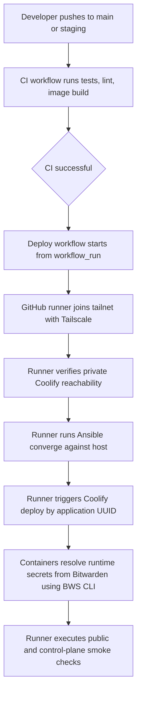

# NEUROMANCERS Network

NEUROMANCERS offers a network for users to offer and request online support.

## Implementation Status

**Audit snapshot:** `docs/implementation-audit-2026-05-09.md`

This project is under active development. Features described below are **intended design** unless explicitly marked as implemented. See the ROADMAP for current delivery phases and the audit snapshot for verified implementation evidence.

[](https://github.com/cookiecutter/cookiecutter-django/)
[](https://github.com/astral-sh/ruff)

License: MIT

---

## Platform Flow (Design)

The platform is designed around the following 20-point user flow:

1. Unauthenticated users see only the login page (`/login`)
2. Superuser logs in
3. Superuser visits `/cms` for Wagtail Admin
4. Superuser prepares branding, API keys, AllAuth theme
5. Superuser creates initial pages + admin checklist
6. Blocks inherit branding styling unless overridden
7. Standard forms (email submissions) and model-connected forms (create/update model instances)
8. Admin-editable email content via MJML (AllAuth + notification emails)
9. Standard users login and verify accounts with expected branding
10. Attribute blocks display model fields in page content
11. Index pages with model-backed layout blocks (grid, row, column)
12. Session detail pages at `/sessions/<uuid>/` (path fixed, content configurable)
13. User profile pages at `/users/<username>/` (path fixed, content configurable)
14. Admin-configured settings pages replacing AllAuth defaults
15. Session detail with conditional buttons (schedule, pay now, add to calendar)
16. Schedule page with calendar block
17. Host Stripe Connect onboarding
18. Peer subscription flow via Stripe
19. Webhook setup via Wagtail admin menu
20. Navbar customization via wagtailmenus + button/card blocks

See [ARCHITECTURE.md](ARCHITECTURE.md) for the system diagram and [ROADMAP.md](ROADMAP.md) for phased delivery status.

---

## Settings

Moved to [settings](https://cookiecutter-django.readthedocs.io/en/latest/1-getting-started/settings.html).

## Basic Commands

### Setting Up Your Users

- To create a **normal user account**, just go to Sign Up and fill out the form. Once you submit it, you'll see a "Verify Your E-mail Address" page. Go to your console to see a simulated email verification message. Copy the link into your browser. Now the user's email should be verified and ready to go.

- To create a **superuser account**, use this command:

      uv run python manage.py createsuperuser

For convenience, you can keep your normal user logged in on Chrome and your superuser logged in on Firefox (or similar), so that you can see how the site behaves for both kinds of users.

### Type checks

Running type checks with mypy:

    uv run mypy neuromancers_network

### Test coverage

To run the tests, check your test coverage, and generate an HTML coverage report:

    uv run coverage run -m pytest
    uv run coverage html
    uv run open htmlcov/index.html

#### Running tests with pytest

    uv run pytest

### Live reloading and Sass CSS compilation

Moved to [Live reloading and SASS compilation](https://cookiecutter-django.readthedocs.io/en/latest/2-local-development/developing-locally.html#using-webpack-or-gulp).

### Celery

This app comes with Celery.

To run a celery worker:

```bash
cd neuromancers_network
uv run celery -A config.celery_app worker -l info
```

Please note: For Celery's import magic to work, it is important _where_ the celery commands are run. If you are in the same folder with _manage.py_, you should be right.

To run [periodic tasks](https://docs.celeryq.dev/en/stable/userguide/periodic-tasks.html), you'll need to start the celery beat scheduler service. You can start it as a standalone process:

```bash
cd neuromancers_network
uv run celery -A config.celery_app beat
```

or you can embed the beat service inside a worker with the `-B` option (not recommended for production use):

```bash
cd neuromancers_network
uv run celery -A config.celery_app worker -B -l info
```

### Email Server

In development, it is often nice to be able to see emails that are being sent from your application. For that reason local SMTP server [Mailpit](https://github.com/axllent/mailpit) with a web interface is available as docker container.

Container mailpit will start automatically when you will run all docker containers.
Please check [cookiecutter-django Docker documentation](https://cookiecutter-django.readthedocs.io/en/latest/2-local-development/developing-locally-docker.html) for more details how to start all containers.

With Mailpit running, to view messages that are sent by your application, open your browser and go to `http://127.0.0.1:8025`

### Sentry

Sentry is an error logging aggregator service. You can sign up for a free account at <https://sentry.io/signup/?code=cookiecutter> or download and host it yourself.
The system is set up with reasonable defaults, including 404 logging and integration with the WSGI application.

You must set the DSN url in production.

## Deployment

The following details how to deploy this application.

### Docker

See detailed [cookiecutter-django Docker documentation](https://cookiecutter-django.readthedocs.io/en/latest/3-deployment/deployment-with-docker.html).

---

## Quick Start (Local Development)

### Prerequisites

- Docker & Docker Compose
- [just](https://github.com/casey/just) command runner

### Setup

```bash
# 1. Generate the project (if starting fresh)
cookiecutter gh:cookiecutter/cookiecutter-django

# 2. Start all services
just up

# 3. Run migrations
just manage migrate

# 4. Create superuser
just manage createsuperuser

# 5. Load language fixtures
just manage loaddata languages_plus

# 6. Open the app
# http://localhost:8000
# Mailpit (email testing): http://localhost:8025
```

### Common Commands

| Command | Does |
|---------|------|
| `just up` | Start all Docker services |
| `just down` | Stop all services |
| `just test` | Run full test suite |
| `just manage <cmd>` | Run Django management command |
| `just shell` | Open Django shell_plus |
| `just logs <service>` | Tail logs for a service |

---

## Feature Overview

### ✅ Implemented (audited)

- **Authentication**: django-allauth with email-based login, login-by-code, username+email login, social account linking for calendar sync
- **User tiers**: Profile.tier_state FSM (Seeker/Peer/Verified Peer/Admin), groups + django-guardian object permissions
- **Session data model**: Peer/group session foundations, pricing structures, host availability rules, reviews, session categories
- **Wagtail CMS**: Full admin at `/cms/`, slug validation, admin guide, onboarding checklist
- **Content block system**: 50+ StreamBlock types including backgrounds, typography, themes, buttons, cards, accordions, grids, forms, and model-mapped form fields
- **Design system**: DaisyUI 5 color palette (system/light/dark), typography, backgrounds (flat/gradient/image), all themeable per-page via StyledPageMixin
- **Branding**: Site-wide settings for colors, fonts, logo, navbar, footer, allauth form labels
- **Site lock**: Maintenance mode with password protection, middleware redirects for non-staff users
- **Email template model**: MJML-based template structure with StreamField for email body content
- **Form system**: 14 field types, multi-step forms, form layouts (rows/columns/grids), model-mapped form fields, success/error handling
- **Notifications**: Profile.notification_prefs JSONField for per-event-type delivery preferences
- **Stripe Connect**: Connected account persistence model, OAuth token exchange, account readiness checks
- **External API settings**: Wagtail-admin-managed keys for Stripe, Whereby, GetPronto, MJML
- **CI/CD**: GitHub Actions pipeline (lint/test/build/deploy), Ansible infrastructure management, `iac/` directory
- **User administration**: Wagtail ModelAdmin, user impersonation foundations

### 🔶 Partial (scaffolded, not end-to-end)

- **Session page routes**: SessionPage with routable URLs exists but templates are missing (10 referenced templates don't exist)
- **User profile page**: UserProfilePage exists but template (`users/profile.html`) is missing
- **MJML email rendering**: EmailTemplate model + MJMLClient exist; `_block_to_mjml()` method is missing; no MJML template files; no email sending logic wired
- **Session event models**: events/models/ peer, group, category, host, duration, review modules are missing (imported in __init__.py but files don't exist)
- **Stripe payment views**: Checkout strategy logic exists (`events/checkout.py`); `events/views/stripe.py` is empty — no webhook handlers or checkout creation views
- **Celery tasks**: Only a demo `get_users_count` task exists; no email, reminder, or payment processing tasks
- **Bootstrap command**: `bootstrap_admin_guide` references markdown files that don't exist; no command to create initial pages
- **AllAuth templates**: Override templates exist but use Bootstrap classes instead of Tailwind/DaisyUI
- **Admin guide**: Model and onboarding tasks exist; markdown source files are missing

### ❌ Not Started

- **Calendar sync**: Google, Microsoft, iCloud sync (OAuth flows, push/free-busy)
- **Moderation**: Flag model, FlagRule, automated flagging Celery tasks
- **Private messaging**: DirectMessage model, inbox
- **Group chat**: SessionThread for group sessions
- **GDPR automation**: Account anonymization, data export
- **Audit log**: django-auditlog not registered/wired
- **i18n**: django-rosetta not installed; no language switcher
- **Analytics**: Admin dashboard charts
- **Waitlist**: WaitlistEntry model
- **Subscriptions**: Stripe subscription for Verified Peer status
- **End-to-end booking/payment flow**: No wired checkout creation, no webhook handling

---

## Architecture

See [ARCHITECTURE.md](ARCHITECTURE.md) for the full system diagram, data models, integration flows, and verified dependency register.

Key architectural decisions:
- **Monolithic Django + Wagtail** — no decoupled frontend; all interactivity via HTMX
- **Celery for async work** — email delivery, external API calls (calendar sync, payment processing)
- **Django signals for sync work** — permission assignment, notification records, status transitions
- **Stripe SDK directly** — no `dj-stripe` for Connect; dj-stripe retained only for subscription/webhook admin UI
- **GetPronto for images, S3 for documents** — images need CDN + transformations; documents use standard S3
- **MJML API for email rendering** — write MJML templates, Wagtail stores content vars, API converts to production-ready HTML
- **Proton Mail SMTP** — transactional email delivery with TLS
- **PostgreSQL 18** — primary data store

---

## Environment Variables

For local development, set environment variables in `.envs/local` as needed. See [secrets runbook](iac/docs/secrets-runbook.md) for the full inventory of secrets, their storage locations, and rotation procedures.

---

## Testing

```bash
# Run all tests
just test

# Run specific test file
just manage test sessions.tests.test_models

# Run with coverage
just coverage
```

Tests use **pytest-django** with **factory_boy** fixtures. Current test coverage is limited to the users app.

---

## Deployment (Coolify + Hetzner)

The application is deployed to a **Hetzner Cloud VPS** running **Coolify**, but Coolify is treated as a **private control plane**, not a public dashboard.

All infrastructure configuration lives in the `iac/` directory at the repository root:

```
iac/
├── monitoring/
│   ├── gatus-config.yml
│   └── prometheus.yml
├── security/
│   ├── crowdsec-config.yml
│   └── fail2ban-jail.local
├── backups/
│   └── backup-script.sh
└── scripts/
    └── server-bootstrap.sh
```

### Secrets and runbooks

- Bitwarden Secrets Manager is the source of truth for deployment and runtime secrets.
- GitHub stores only `BWS_ACCESS_TOKEN` for workflow authentication to Bitwarden.
- Coolify should hold only `BWS_ACCESS_TOKEN` for runtime secret resolution.
- Production containers are expected to pull their own secrets from Bitwarden at startup.
- See `iac/docs/secrets-runbook.md` for inventory and rotation procedures.
- See `iac/docs/operator-guide.md` for operator flow and completion checklist.
- See `iac/docs/coolify-env-mapping.md` for the runtime key registry.

### Deployment Pipeline



### Control Plane Rules

- Coolify is reachable only over Tailscale.
- Do not use Tailscale Funnel for Coolify.
- Public ports are limited to the application ingress on `80` and `443`.
- Operators reach Coolify using its Tailscale IP or MagicDNS hostname.
- GitHub `production` environment protection must be configured with required reviewers and branch restrictions for `main`.

### Environment Variables (Coolify)

| Variable | Purpose |
|----------|---------|
| `DJANGO_SECRET_KEY` | Django secret key |
| `DJANGO_ALLOWED_HOSTS` | Comma-separated allowed hosts |
| `DJANGO_AWS_ACCESS_KEY_ID` | S3 access key for document storage |
| `DJANGO_AWS_SECRET_ACCESS_KEY` | S3 secret key for document storage |
| `DJANGO_AWS_STORAGE_BUCKET_NAME` | S3 bucket name |
| `DJANGO_SERVER_EMAIL` | Server sender address |
| `REDIS_URL` | Redis connection URL |
| `DATABASE_URL` | PostgreSQL connection URL |
| `CELERY_FLOWER_USER` | Flower username |
| `CELERY_FLOWER_PASSWORD` | Flower password |

Third-party API credentials (Stripe, Whereby, GetPronto, MJML, SMTP, Sentry) are runtime-administered through Wagtail Site Settings.

---

## Monitoring

- **Sentry**: Exception tracking and performance monitoring.
- **Mailpit**: Local email testing (port 8025).
- **django-debug-toolbar**: Request/query profiling in development.
- **Celery task results**: Viewable in Django admin (django-celery-results).

---

## Project Roadmap

See [ROADMAP.md](ROADMAP.md) for the complete implementation plan and phased delivery.

The roadmap is organized around the 20-point platform flow:
- **Phase A**: Foundation & Block System *(current — largely complete)*
- **Phase B**: Auth, Pages & Admin Experience *(in progress)*
- **Phase C**: Session Models, Routes & Forms *(in progress)*
- **Phase D**: Booking, Payments & Stripe Connect *(scaffolded)*
- **Phase E**: Email, Notifications & MJML *(scaffolded)*
- **Phase F**: Calendar, Moderation & Production Hardening *(not started)*
